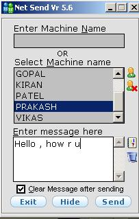



## Net Send v5

### Description

this utility if for sending Messeges on the network.it has a directory listing of all pc's on ur domain. u can clear/Delete the eventview or View it directly of our Pc or any pc on the network, just select the pc and click view eventviewer. this was one of my most succesfull utility. please Vote for Me ...!!!!!!

Prakash Patel

imprakashpatel@yahoo.co.in / ppatel@in.hoc.com
 
### More Info
 

             |
---                |---
**Submitted On**   |2005-03-23 10:30:04
**By**             |[imprakashpatel](https://github.com/Planet-Source-Code/PSCIndex/blob/master/ByAuthor/imprakashpatel.md)
**Level**          |Advanced
**User Rating**    |5.0 (10 globes from 2 users)
**Compatibility**  |VB 6\.0
**Category**       |[Complete Applications](https://github.com/Planet-Source-Code/PSCIndex/blob/master/ByCategory/complete-applications__1-27.md)
**World**          |[Visual Basic](https://github.com/Planet-Source-Code/PSCIndex/blob/master/ByWorld/visual-basic.md)
**Archive File**   |[Net\_Send\_v1867343242005\.zip](https://github.com/Planet-Source-Code/imprakashpatel-net-send-v5__1-59609/archive/master.zip)

